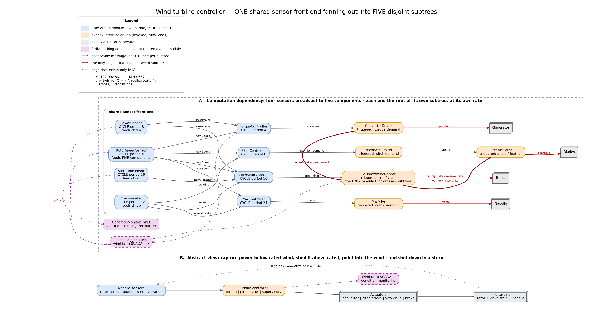
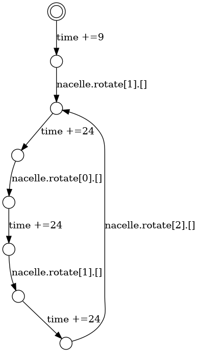

# Wind turbine controller — NREL ROSCO-class reference controller



## What this system is

The controller inside the nacelle of a utility-scale wind turbine. A handful of sensors on the machine
are read continuously — rotor speed, generator power, wind speed and direction at the anemometer,
nacelle vibration — and those readings are used by four completely different control jobs at four
completely different speeds:

- **Generator torque control.** Below rated wind, ask the converter for the torque that extracts the
  most power from the wind that is there. Fast.
- **Blade pitch control.** Above rated wind, twist the blades to spill the excess so the machine does
  not over-speed or over-load. Slower, and rate-limited: blades physically cannot slew instantly.
- **Yaw control.** Turn the whole nacelle to face the wind. By far the slowest loop — a turbine yaws
  over minutes, not milliseconds.
- **Supervisory control.** Watch for the conditions that mean *stop now* — a storm above the cut-out
  wind speed, or vibration that says something in the drive train is failing — and shut the machine
  down: feather the blades, trip the converter off the grid, set the brake.

And then, on top of all four, the wind farm's **SCADA** link and a retrofitted **condition-monitoring**
system, which record but command nothing.

The open-source reference for this is NREL's **ROSCO** controller running against **OpenFAST**, which is
what the wind-energy research community actually uses.

## Why it is a good case study for this work

**This is the shared-sensor fan-out.** Every other case study in the collection is a pipeline, or
several pipelines that were never related to each other. Here one small sensor front end is read once
and broadcast, and each consumer is the root of its **own subtree** — its own period, its own chain of
modules, its own actuator. The rotor-speed sensor alone feeds five of them:

```
RotorSpeedSensor --> TorqueController    -> ConverterDriver -> Generator
                 --> PitchController     -> PitchRateLimiter -> PitchActuator -> Blades
                 --> YawController       -> YawDrive -> Nacelle
                 --> SupervisoryControl  -> ShutdownSequencer -> Brake
                 --> ScadaLogger         (removable)
```

In the Lingua Franca diagram those subtrees are visibly disjoint: sensors on the left, four independent
chains running right, four different plants at the ends. Exactly **one** module is allowed to reach
across them — `ShutdownSequencer` — which is what a supervisor is *for*.

**That shape is the interesting one for slicing**, for a reason the other case studies cannot show:

| | what the shared source means |
|---|---|
| PX4 (`old/07`) | one cascade — deleting a stage breaks everything below it |
| GPCA (`old/10`) | independent cycles that meet only at the actuator |
| PMSM drive (`old/14`) | one deep chain, peripherals joining it along its length |
| **Turbine (this one)** | **one source, five consumers — the same value is on five different paths at five different rates** |

A single sensor reading is simultaneously upstream of four different observables, reaching each one
through a different number of modules and after a different amount of time. So a slice taken for
`Generator.applyTorque` and a slice taken for `Blades.setAngle` share their root and diverge
immediately, and the `after` reasoning has to be done independently along each branch.

**Four plants, four observables — one per subtree.** That makes the second experiment below unusually
clean.

**The question.** Both removable modules are things that really are added to turbines already spinning
in a field:

> Every turbine reports to the wind-farm SCADA system, and condition monitoring — vibration trending
> for gearbox and bearing health — is retrofitted to machines already in service.
> Can either change how the machine shuts itself down in a storm?

It must not. And note that `ConditionMonitor` reads the *vibration* signal, which is the same signal the
supervisor trips on — so, as in `old/15`, the removable module is reading a value that is genuinely
on the safety path.

## The modules in `model.rebeca`

### The shared sensor front end

| Module | Kind | Period | Feeds |
|---|---|---|---|
| `RotorSpeedSensor` | **time-driven** | 4, offset 0 | torque, pitch, yaw, supervisor, SCADA — **five** |
| `PowerSensor` | **time-driven** | 8, offset 1 | torque, supervisor, SCADA |
| `Anemometer` | **time-driven** | 12, offset 5 | pitch, yaw, supervisor |
| `VibrationSensor` | **time-driven** | 16, offset 7 | supervisor, condition monitor |

### The five subtrees

| # | Subtree | Modules | Ends at |
|---|---|---|---|
| 1 | torque | `TorqueController` (period 4) → `ConverterDriver` | **`Generator.applyTorque` (observable)** |
| 2 | pitch | `PitchController` (period 8) → `PitchRateLimiter` → `PitchActuator` | **`Blades.setAngle` (observable)** |
| 3 | yaw | `YawController` (period 24) → `YawDrive` | **`Nacelle.rotate` (observable)** |
| 4 | safety | `SupervisoryControl` (period 16) → `ShutdownSequencer` | **`Brake.applyBrake` / `Brake.releaseBrake` (observable)** |
| 5 | recording | `ScadaLogger`, `ConditionMonitor` | **SINK — removable** |

`ShutdownSequencer` additionally sends `feather` into subtree 2 and `openBreaker` into subtree 1. Those two
edges are the only ones in the model that cross a subtree boundary, and they are drawn in bold dark red
in the diagram.

Two details worth knowing, both of which are the sort of thing that quietly ruins a model:

- The rotor speed cycles over **four** values (2, 3, 4, 5), not three. With three it phase-locks against
  the 24-unit yaw period — six speed samples per yaw tick, and six is a multiple of three, so the yaw
  controller saw the same rotor speed every single time and the yaw drive never moved. Four values break
  the lock and the whole subtree comes alive.
- The pitch **rate limiter** is a real module, not padding: it moves the blade one step per demand, so a
  step change in demand takes several cycles to reach the blades. It is also what makes subtree 2 the
  deepest of the four.

## How to use it

```
O  = { Generator.applyTorque , Blades.setAngle ,
       Nacelle.rotate , Brake.applyBrake , Brake.releaseBrake }

M' = model.rebeca as it stands
M  = delete every line marked  // OPTIONAL,  delete the block between the
     OPTIONAL MODULE banners, and apply the five  // M:  replacements in main
```

Expected: slices equal, Tiny Twin reusable.

**Verified.** Exhaustive exploration under the paper's SOS rules gives:

| | States | Transitions | Largest bag (queue bound 20) |
|---|---|---|---|
| `M'` | 102,992 | 279,939 | 3 |
| `M` | 43,567 | 96,872 | 3 |

Note how much of the state space the two recording modules account for — deleting them removes about
three fifths of it, while changing nothing observable. That gap *is* the argument for the technique.

## The tiny twin



Taking **one subtree at a time** is what this case study is for, so the shipped twin is for the yaw
branch alone:

```
O = { Nacelle.rotate }          plus time

python tinytwin.py -o out model.statespace observable_messages.txt
```

102,992 states reduce to **8 states and 8 transitions**, and `M` and `M'` give byte-identical twins
(cross-checked against mCRL2 `ltsconvert` 202607.0):

```
des (0,8,8)
(0,"time +=9",1)
(1,"nacelle.rotate[1].[]",2)
(2,"time +=24",3)
(3,"nacelle.rotate[0].[]",4)
(4,"time +=24",5)
(5,"nacelle.rotate[1].[]",6)
(6,"time +=24",7)
(7,"nacelle.rotate[2].[]",2)
```

That is the yaw loop and nothing else: an offset of 9, then a command every 24 — the slowest period
in the model — cycling yaw right, yaw left, yaw right, hold. All four sensors, the storm logic, the
pitch rate limiter and both recording modules have vanished, because none of them is upstream of
`Nacelle.rotate`.

### Which subtree to pick, and why it matters

The generator's time accumulator drops time-only cycles. A subtree that can go **permanently quiet**
therefore produces a twin that is missing behaviour, and this model has exactly that case: once the
turbine trips in a storm it stays tripped, so nothing more is commanded. Measured:

| `O` | Twin | Sound? |
|---|---|---|
| `nacelle.rotate` + time | 8 states, 8 transitions | **yes** |
| `blades.setangle` + time | 22 states | reaches a dead end |
| `generator.applytorque` + time | 17 states | **no** — silently loses `applyTorque(0)`, the storm trip |
| `generator.applytorque`, untimed | 10 states | yes |
| `brake.*` + time | 1 state | **no** — collapses entirely |
| all four plants + time | 401 states | **no** — loses `releaseBrake` |

The yaw subtree is the sound choice because the yaw drive is commanded on every one of its cycles,
so time is always punctuated by an observable action. This is worth knowing before choosing an
observable set for any model in the collection.

**Second experiment — take one observable at a time.** Because there are four plants, one per subtree,
you can slice for each separately and compare:

- `O = { Nacelle.rotate }` — the yaw subtree. Needs `RotorSpeedSensor` and `Anemometer`, but **not**
  `PowerSensor` and **not** `VibrationSensor`, and none of the pitch or torque modules.
- `O = { Generator.applyTorque }` — needs `RotorSpeedSensor` and `PowerSensor`, **and** the entire
  safety subtree including the vibration sensor and the anemometer, because `openBreaker` sets the generator
  torque to zero.
- `O = { Blades.setAngle }` — the same, via `feather`.

So `VibrationSensor` is out of the slice for one observable and in it for two others, in the same model,
with no change to the code. That is a compact demonstration that the analysis follows dependencies
rather than module boundaries — and it is only possible because the subtrees are genuinely separate.

## Sources

- NREL **ROSCO** — the reference open-source wind turbine controller, with exactly these control
  modules — <https://github.com/NREL/ROSCO> · <https://rosco.readthedocs.io/en/latest/>
- **OpenFAST**, the aero-servo-elastic simulator ROSCO is built against —
  <https://github.com/OpenFAST/openfast> · <https://openfast.readthedocs.io/en/main/>
- J. Jonkman, S. Butterfield, W. Musial, G. Scott, *Definition of a 5-MW Reference Wind Turbine for
  Offshore System Development*, NREL/TP-500-38060 — the reference machine these controllers are tuned
  for, including its rated wind speed and cut-out behaviour —
  <https://www.osti.gov/biblio/947422>

## About the model file

**I wrote `model.rebeca` myself.** It is a Timed Rebeca abstraction of the controller described above:
the four sensor cycles, the four control subtrees with their own rates, the shutdown sequencer, and the
two recording modules. A real controller computes torque from a tip-speed-ratio law and pitch from a
gain-scheduled PI regulator against a full aero-elastic model; here both are integer arithmetic. The
point of the case study is the fan-out structure and the rates, not the aerodynamics.

No `delay`, no `deadline`, no local variables. Message-queue sizes are 20 throughout.

Three naming notes, all of them forced by the tooling and all of them improvements anyway:

- The converter's re-close command is `reconnect`, not `reset`, because `reset` is a reserved keyword
  in Lingua Franca and the two files are kept in step. `reconnect` is the better word for a grid-tied
  converter.
- The brake commands are `applyBrake` / `releaseBrake`, not `apply` / `release`, and the converter
  trip is `openBreaker`, not `tripOff`. **No message name may be a substring of another.** The
  tiny-twin caster identifies a transition's arguments by searching the source state's queued
  messages for the message name, so while `apply` was a substring of `applyTorque` every `Brake.apply`
  transition whose state also had an `applyTorque(0)` queued came out labelled
  `brake.applytorque[0]` — 3,750 of them, silently mislabelled and therefore invisible to any
  observable set that selected `brake.apply`.
- `PitchActuator.release` became `restorePitch` for the same reason.

The diagram was drawn with Graphviz for this repository.

## The Lingua Franca version

`model.lf` is the same system written in Lingua Franca. The mapping is:

| Timed Rebeca | Lingua Franca |
|---|---|
| time-driven module (`self.m() after(P)`) | reactor with `timer t(offset, period)` |
| event-driven `msgsrv` | reaction triggered by an input port |
| `x.m(v)` | connection `sender.out -> x.in` |
| `after(d)` on a send | `after d ms` on the connection, or a `logical action` with offset `d` |
| `statevars` | `state` |
| `?(a, b)` nondeterministic choice | LF is deterministic, so the choices are enumerated cyclically |

**This is the case study where the LF fan-out rule pays off.** `RotorSpeedSensor` has a *single*
`newSpeed` output connected to four different reactors:

```
speed.newSpeed -> torque.newSpeed
speed.newSpeed -> pitch.newSpeed
speed.newSpeed -> yaw.newSpeed
speed.newSpeed -> supervisor.newSpeed
```

That is legal and it is the whole picture in one place: an output may fan out as widely as it likes; it
is only an *input* that may not have two sources. Case studies 10–13 hit the other side of that rule and
needed one port per sender. Here nothing has to be duplicated, and the diagram shows the broadcast
directly.

**The graph is acyclic**, so no delay and no cycle-breaking reaction order. The rotor speeding up and
the blades biting the wind is physics, and it closes outside the model boundary. Reaction order is used
only inside `ConverterDriver` and `PitchActuator`, where the supervisor's `openBreaker` and `feather` are
declared before the normal command so that a shutdown wins at the same tag.

Verified with `lfc` 0.12.1: both `M'` and `M` compile, build to C and run. Running the two and diffing
the `OBSERVABLE` lines gives 31 identical events. The trace shows the shutdown clearly — at t = 13 ms
the brake, the blades and the generator are all commanded at the same tag:

```
t=13000000  OBSERVABLE  brake applyBrake
t=13000000  OBSERVABLE  setAngle(3)
t=13000000  OBSERVABLE  applyTorque(0)
```

> **`model.svg` is stale.** It was exported from the Lingua Franca VS Code extension before the port
> renames above, so it still shows `apply`, `release` and `tripOff`. Re-export it to bring it back in
> step; nothing else in the folder depends on it.
