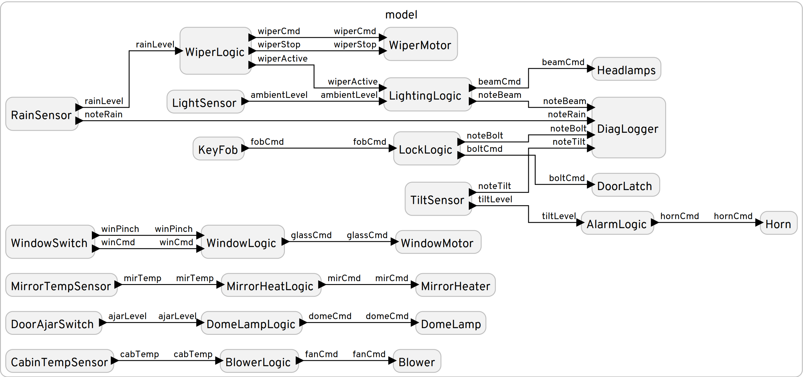
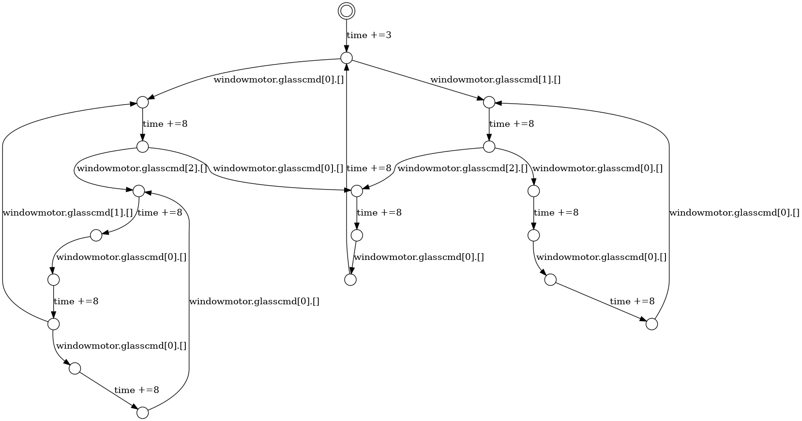

# Automotive body control module — wide peripheral fan-out



This is **topology 2** — *wide periodic fan-out with one peer dependency* — made concrete.

## What this system is

The body control module is the ECU in a car that runs everything that is not the powertrain or the
brakes. It sits on the body CAN and LIN buses and owns a pile of unrelated peripherals: the wipers,
the exterior lights, the central locking, the windows, the heated mirrors, the interior lamp, the
blower, the alarm. Each of those is polled or serviced on **its own period**, and — this is the point —
almost none of them has anything to do with any of the others. Locking a door does not change the
blower speed. Heating a mirror does not move a window.

Eight branches, each three modules deep:

| | Branch | Peripheral (period, offset) | Logic | Load |
|---|---|---|---|---|
| A | wipers | `RainSensor` (16, 0) | `WiperLogic` | `WiperMotor` |
| B | exterior lighting | `LightSensor` (12, 1) | `LightingLogic` | `Headlamps` |
| C | central locking | `KeyFob` (24, 2) | `LockLogic` | `DoorLatch` |
| D | power window | `WindowSwitch` (8, 3) | `WindowLogic` | **`WindowMotor`** |
| E | mirror heating | `MirrorTempSensor` (48, 4) | `MirrorHeatLogic` | `MirrorHeater` |
| F | interior lamp | `DoorAjarSwitch` (16, 5) | `DomeLampLogic` | `DomeLamp` |
| G | blower | `CabinTempSensor` (24, 6) | `BlowerLogic` | `Blower` |
| H | alarm | `TiltSensor` (48, 7) | `AlarmLogic` | `Horn` |

25 modules including the removable one. **Five distinct periods** — 8, 12, 16, 24, 48 — plus a 4-unit
fade inside branch F, and **eight distinct offsets**, one per branch, so the branches interleave
rather than all firing on the same edge. The hyperperiod is 48.

## The one edge between branches

Exactly one message crosses a branch boundary:

```
WiperLogic --wiperActive--> LightingLogic
```

When the wipers start, the low beam must come on. That is a real rule, not a modelling convenience:
several US states require headlights whenever the windscreen wipers are in use, and the equivalent
exists in a number of European markets. In the diagram it is the one arrow that leaves its own row —
`WiperLogic.wiperActive` reaching down into `LightingLogic` — and it is the `a3 -> b2` edge of the
abstract topology in `model.dot`.

Everything else is a peripheral in its own right. Branch D never looks at branch G; branch E never
looks at anything.

## Why this shape matters here

Sample 1 is the shared-source fan-out: one sensor feeding five consumers, so the subtrees have a
common root. **This one is the opposite** — the branches are genuinely disjoint, and the interesting
question is what that buys you:

- A slice taken for one branch's actuator is **three modules out of twenty-five**. Nothing else can
  reach it, so nothing else can be in the slice.
- The state space, on the other hand, is the *product* of the branches: 124,159 states for a model
  whose every individual branch is trivial. Independence is cheap for slicing and expensive for
  model checking, which is exactly the gap the technique is meant to exploit.
- And the single peer dependency gives the counter-example in the same file: a slice for
  `Headlamps.beamCmd` is **not** three modules, because it has to pull in branch A as well.

## Where the nondeterminism is

Three inputs are genuine environment nondeterminism, and they are the things a car really cannot
predict:

| Module | Choice | Why |
|---|---|---|
| `RainSensor` | `?(0, 1, 2)` | dry / intermittent / continuous — the weather |
| `WindowSwitch` | `?(0, 1)` | whether something is in the window frame (anti-pinch) |
| `KeyFob` | `?(0, 1)` | whether the driver pressed lock or unlock |
| `TiltSensor` | `?(0, 1)` | whether the car is being jacked up |

Everything else is a deterministic cycle, which is what keeps the model inside its budget. The rocker
switch is a person going released → up → down → round again; ambient light walks dusk → night → dawn
→ day; cabin temperature ramps.

One detail worth knowing: `WindowSwitch` puts the anti-pinch reading **and** the rocker command into
the same bag at the same instant, so the guard and the command genuinely race. Both interleavings are
explored, and the anti-pinch case is the one that matters — it is the difference between stopping the
glass and trapping a hand.

## The question

> A workshop plugs a tester into the OBD-II socket and the module starts streaming body events over
> UDS. An owner leaves an insurance dongle in the socket permanently. Can either change how the
> windows, the locks or the lights behave?

It must not. The `DiagLogger` reads from four of the eight branches — rain, beam, bolt and tilt — and
commands nothing.

## How to use it

```
O  = { WindowMotor.glassCmd }          (branch D, one independent peripheral)

M' = model.rebeca as it stands
M  = delete every line marked  // OPTIONAL,  delete the block between the
     OPTIONAL MODULE banners, and apply the four  // M:  replacements
```

**Verified.** Exhaustive exploration under the paper's SOS rules:

| | States | Transitions |
|---|---|---|
| `M'` | 124,159 | 194,360 |
| `M` | 76,694 | 105,006 |

Deleting one module that commands nothing removes **38% of the state space** and changes nothing
observable.

## The tiny twin



Generated with [TinyTwinGenerator](https://github.com/AliAtaollahi) from the `.statespace` file:

```
python tinytwin.py -o out model.statespace observable_messages.txt
```

`observable_messages.txt` holds `windowmotor.glasscmd,time`. The result is **19 states and 23
transitions** — for a 124,159-state model. `M` and `M'` produce byte-identical twins.

```
des (0,23,19)
(0,"time +=3",1)
(1,"windowmotor.glasscmd[0].[]",2)
(1,"windowmotor.glasscmd[1].[]",3)
(2,"time +=8",4)
(3,"time +=8",5)
(4,"windowmotor.glasscmd[0].[]",6)
(4,"windowmotor.glasscmd[2].[]",7)
...
```

Read it as the branch's whole life:

- `time +=3` — the branch's **offset**. Nothing observable happens before it.
- then `glasscmd` and `time +=8` strictly alternate — the branch's **period**.
- each `glasscmd` **branches**, and that is the anti-pinch race: `[0]` is the motor being held
  (obstruction detected, or the glass already at an end stop), `[1]` is driving up, `[2]` driving down.
- the 19 states are the glass height (0, 1, 2) crossed with the rocker phase and the pinch outcome.

The Lingua Franca run agrees exactly — `glassCmd` first fires at t = 3 ms and then every 8 ms:

```
t=3000000   OBSERVABLE  glassCmd(0)
t=11000000  OBSERVABLE  glassCmd(2)
t=19000000  OBSERVABLE  glassCmd(0)
t=27000000  OBSERVABLE  glassCmd(1)
```

### Choosing the observable set

Not every branch gives a usable twin, and the reason is worth recording. The generator's time
accumulator drops time-only cycles, so **a branch whose actuator can fall silent for a whole cycle
produces a truncated twin**. Measured on this model:

| `O` | Twin | Sound? |
|---|---|---|
| `windowmotor.glasscmd` + time | 19 states, 23 transitions | **yes** |
| `blower.fancmd` + time | 9 states | yes |
| `domelamp.domecmd` + time | 7 states | yes |
| `wipermotor.*` + time | 2 states | yes, but trivial |
| `headlamps.beamcmd` + time | 3 states | **no** — dead end |
| `doorlatch.boltcmd` + time | 1 state | **no** — collapses |
| `horn.horncmd` + time | 1 state | **no** — collapses |
| all eight loads + time | 708 states | **no** — loses the lock and horn commands |

Branch D is the right choice because `glassCmd` is emitted on **every** cycle, so time is always
punctuated by an observable action and no time-only cycle can form. The lock and the horn only speak
when something changes, which can be never for a long stretch.

## Sources

- **Body control module** — what one is and what hangs off it —
  <https://en.wikipedia.org/wiki/Body_control_module>
- **LIN** — the sub-bus the mirrors, the rain sensor and the window modules actually sit on —
  <https://en.wikipedia.org/wiki/Local_Interconnect_Network>
- The **wipers-on ⇒ headlights-on** rule that gives the one cross-branch edge —
  <https://en.wikipedia.org/wiki/Daytime_running_lamp> ("Several states … have laws that require
  headlights to be switched on when windshield wipers are in use.")
- **Open Vehicle Monitoring System v3**, open-source firmware that talks to exactly these body
  functions over the vehicle bus — <https://github.com/openvehicles/Open-Vehicle-Monitoring-System-3>
- **opendbc**, open message definitions for production body CAN buses —
  <https://github.com/commaai/opendbc>
- The task/period structure follows the **AUTOSAR Classic Platform** body domain, where each function
  is a runnable mapped onto a periodic task.

## About the model file

**I wrote `model.rebeca` myself.** It is a Timed Rebeca abstraction: eight peripheral branches at
their own rates, the anti-pinch race, the theatre-dimming fade, and one removable diagnostic sink. A
real BCM has dozens more functions and talks UDS, LIN scheduling tables and CAN frames; here every
value is a small integer. The point of the case study is the fan-out, the periods and the single
peer dependency, not the bus protocols.

No `delay`, no `deadline`, no local variables. Message-queue sizes are 20 throughout.

Two naming notes, both forced by keeping the two files in step:

- `mode` and `state` are Lingua Franca keywords, so the wiper mode is `wiperMode` and the latch
  parameter is `closed`.
- No message name is a substring of another. That matters more than it looks: the tiny-twin caster
  identifies a transition's arguments by searching the source state's queued messages for the
  message name, so a name like `apply` inside `applyTorque` silently attaches the wrong arguments.

`diagram.png` is not hand-drawn: it is the Lingua Franca diagram of `model.lf`, generated straight from
the source with `lfd model.lf` (the diagram generator shipped in the Lingua Franca CLI, the same
synthesis the VS Code extension shows). `model.svg` is that diagram as vector. Because both come out of
the model they cannot drift out of step with it — which is also why the eight branches show up as eight
separate rows with nothing between them, and `model.dot` is kept alongside for the *abstract* topology
with the periods and the roles marked on it.

## The Lingua Franca version

`model.lf` is the same system in Lingua Franca. The mapping is the repository's usual one:

| Timed Rebeca | Lingua Franca |
|---|---|
| time-driven module (`self.m() after(P)`) | reactor with `timer t(offset, period)` |
| event-driven `msgsrv` | reaction triggered by an input port |
| `x.m(v)` | connection `sender.out -> x.in` |
| zero-delay `self.m()` | `logical action` scheduled at delay 0 (next microstep, not a cycle) |
| `self.m() after(d)` | `logical action` scheduled at `d` |
| `?(a, b)` | LF is deterministic, so the choices are enumerated cyclically |

The graph is **acyclic**: the glass moving, the lamp lighting and the mirror warming are physics and
they close outside the model boundary, so no delay and no cycle-breaking reaction order is needed.

**One deliberate difference.** `WindowSwitch` emits the anti-pinch reading and the rocker command at
the same instant. Rebeca puts both in a bag, so the order is a race and the state space explores both.
Lingua Franca is deterministic, so `WindowLogic` declares the `winPinch` reaction first and the guard
always wins. The LF run is one of the interleavings the Rebeca model admits — which is the honest
relationship between the two, and worth stating rather than papering over.

Verified with `lfc` 0.12.1: both `M'` and `M` compile, build to C and run. Diffing the `OBSERVABLE`
lines of the two runs gives **92 identical events**. The first eight show the branches coming up on
their eight distinct offsets, and the wiper-to-headlamp coupling firing at t = 0:

```
t=0         OBSERVABLE  wiperCmd(1)
t=0         OBSERVABLE  beamCmd(1)      <- forced by the wipers, not by the light sensor
t=2000000   OBSERVABLE  boltCmd(1)
t=3000000   OBSERVABLE  glassCmd(0)
t=4000000   OBSERVABLE  mirCmd(1)
t=5000000   OBSERVABLE  domeCmd(2)
t=6000000   OBSERVABLE  fanCmd(1)
t=7000000   OBSERVABLE  hornCmd(1)
```
